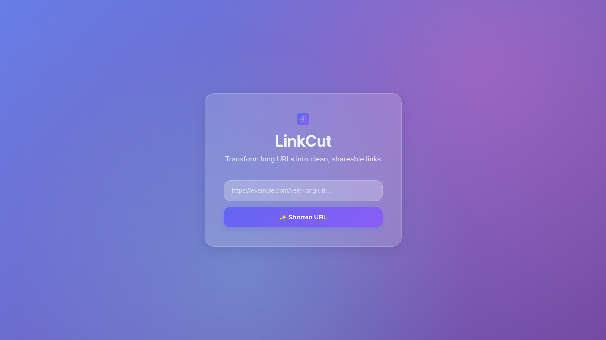

# LinkCut - A Simple URL Shortener



## About the Project

**LinkCut** is a simple, modern URL shortening service built with an **Express.js** backend and a beautiful, single-page frontend. The project is designed to be a lightweight, non-CRUD application that demonstrates fundamental web development concepts.

The primary goal of LinkCut is to transform long, messy URLs into short, clean, and shareable links. This project is ideal for developers looking to understand how a backend API communicates with a vanilla JavaScript frontend.

### Features
- **URL Shortening**: Easily convert any long URL into a short, unique link.
- **Link Redirection**: The short links redirect to the original long URL.
- **In-Memory Storage**: Data is stored in-memory using a `Map`, which simplifies the project by avoiding the complexity of a database.
- **Modern UI**: A clean, single-page frontend with a modern design and a copy-to-clipboard button for a great user experience.

---

## Technology Stack

- **Backend**:
  - **Node.js**: JavaScript runtime environment.
  - **Express.js**: Web framework for handling API routes.
  - **TypeScript**: Adds static typing for better code quality and fewer bugs.
  - **Nano ID**: A small, secure, URL-friendly unique string generator.
  - **CORS**: Middleware to allow cross-origin requests from the frontend.

- **Frontend**:
  - **Vanilla JavaScript**: Handles all the dynamic interactions with the API.
  - **HTML5 & CSS3**: Provides the structure and modern styling.

---

## Getting Started

### Prerequisites

To run this project, you need to have **Node.js** and **npm** installed on your machine.

### Installation

1.  **Clone the repository**:
    ```bash
    git clone [https://github.com/josevbrito/LinkCut.git](https://github.com/josevbrito/LinkCut.git)
    cd LinkCut
    ```
2.  **Install dependencies**:
    ```bash
    npm install
    ```
    This will install both the production dependencies (Express, Nanoid) and the development dependencies (TypeScript, Nodemon).

### Running the Project

1.  **Start the development server**:
    ```bash
    npm run dev
    ```
    The server will start on `http://localhost:3000`. `nodemon` will automatically restart the server whenever you make changes to the code.

2.  **Access the application**:
    Open your web browser and navigate to `http://localhost:3000`. You should see the LinkCut homepage.

---

## How it Works

The project is structured with a simple, yet effective, separation of concerns:

-   The **frontend** is located in the `public/` directory (`index.html`, `script.js`). The Express server is configured to serve these static files when you access the root URL (`/`).
-   The **backend** API is defined in `src/index.ts`. It handles two main routes:
    -   `POST /shorten`: Accepts a JSON body with a `url` and returns a shortened link.
    -   `GET /:shortCode`: Redirects the user to the original long URL.

The `script.js` file on the frontend sends `fetch` requests to the `/shorten` endpoint and dynamically updates the HTML with the result.